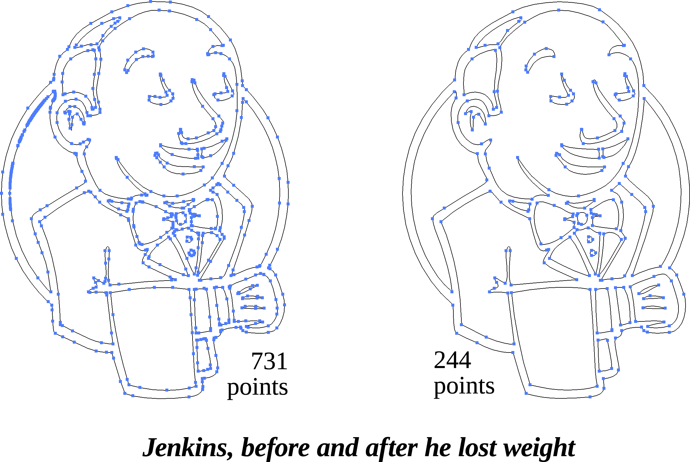
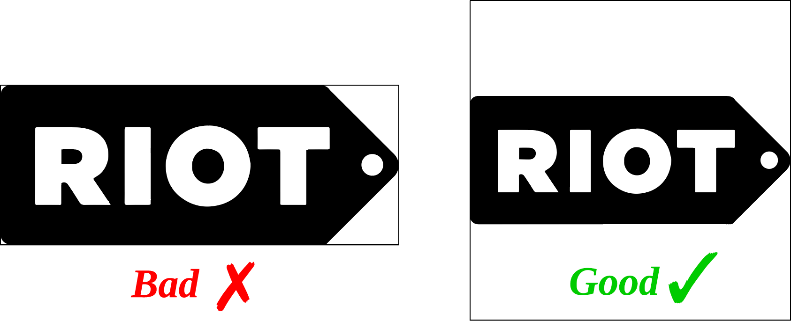
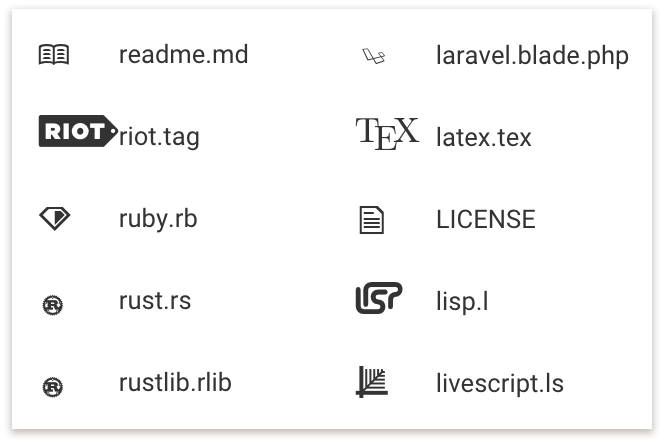

DevOpicons: Optimised Devicons
==============================

This is simply a heavily-optimised version of the [Devicons](http://vorillaz.github.io/devicons/) font, created by [Theodore Vorillas](http://twitter.com/vorillas).
All credit for the original icon vectors goes to him and his project's contributors; I've simply cleaned up the typeface by annihilating excess geometry, clearing duplicate control points, and basically just being a meticulous prick.

**Result:** 17 KBs knocked off the WOFF's filesize. That's a pretty impressive reduction when you consider the format's *already compressed*.

Size fixes
----------
Aside from optimising the geometry of the vectors, I've also scaled them so they fit their containing canvas. Having "breathing space" in an icon font tends to be helpful only when the final design is known in advance. If mixed with other icon fonts of varying margin sizes, it can lead to disproportionate sizes and a whole lot of unsavoury CSS tweaking for different font families.

For instance, consider this:

You've probably dealt with this before. This leads to a lot of dishonest measurements in the inspector tools when ascertaining the calculated width and height of icons in the DOM. When implementing pixel-perfect design, this can become a bit of a headache.

The fix is easy - eliminate the margins altogether. Leave tweaking of space to the developer, because they're the ones dealing with making their design look pretty. You aren't. Letting icons fill their canvas results in more honest metrics:

### Word of caution
If an icon's dimensions are landscape-shaped, avoid fitting it to a rectangular canvas:

Otherwise, you wind up with this:

Because remember, `em` and `rem` units are scaled relative to text *height*. So avoid letting that aspect ratio exceed 1.0!

Ramble, ramble, ramble
----------------------

I really don't know when to stop typing. Anyway, enough typography lessons. Enjoy the improved filesize.
